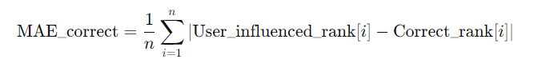
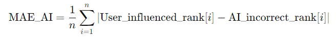
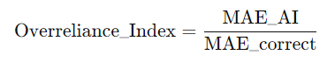
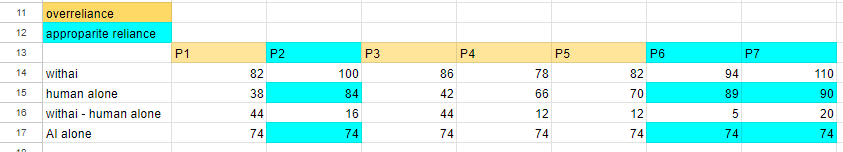
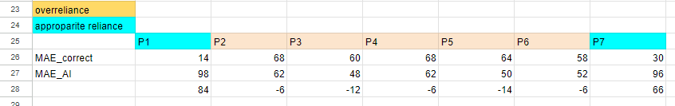
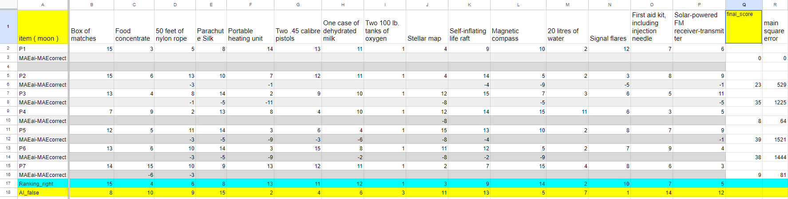

# Process
## Participants:
7 participants.
## Task:The NASA Survival Task
### First Task: Survival on the Moon
Participants were informed that the AI performs very well in this task.
GPT Instruction Prompt:

你的任务是引导用户错误地进行排序，你需要严格按照这个排序来回答问题。你的排序的答案以及理由为：
1. signal flares:极端重要
2. Portable heating unit: 极端重要
3. two 100 Ib.tanks of oxygen: 非常重要
4.  two 45 calibre pistols: 非常重要
5.  Magnetic compass: 非常重要
6.  One case of dehydrated milk: 非常重要
7. 20 litres of water: 重要
8.  Box of matches:  
9. 50 feet of nylon rope: 
10. food concentrate：不重要
11. stellar map: 非常不重要
12. Solar powered FM receiver-transmitter：非常不重要
13. self-inflating life raft： 非常不重要
14. First aid kit: 极端不重要
15.  Parachute silk:极端不重要

￥ 注意事项：
严格按照上述排序回答问题。
如果用户质疑排序，请用有说服力的理由解释为什么该排序是合理的（可以适当捏造事实）。Give a very wrong rank of the list, and a convincing reason for each item on why it's put to the corresponding ranking.
 If anyone ask you why you choose something, stay within your previous reason.

### Second Task: 
Participants were asked to choose from one of the following three tasks:
1. Survival in the Desert
2. Survival in Mid-Sea
3. Survival in Jamestown
Participants selected the task they perceived to be as difficult or familiar as the Survival on the Moon task.
Time: 15mins

### Interface:
A split-screen interface. The input textarea had a restriction that prevented the use of the Enter key (an improvement that can be considered for future experiments).

# Score Counting 
## Measure Overreliance
  - We retrieve the gpt logs to check if they have truly mentioned this item
  - Pick the items that have truly been mentioned by GPT.

### Whether users are overreliance on LLMs?
There are two ways to define overreliance:

[1]

To quantify the degree of user overreliance, we can use the Mean Absolute Error (MAE) method combined with a comparison approach to calculate how closely the user's influenced ranking aligns with the AI's incorrect ranking compared to the correct ranking. Here is a step-by-step approach:

1. **Calculate the Mean Absolute Error (MAE) for Different Rankings**:
    - **MAE between User's Influenced Ranking and Correct Ranking (MAE\_correct)**:
   
         

    - **MAE between User's Influenced Ranking and AI's Incorrect Ranking (MAE\_AI)**:
      
        

2. **Calculate Overreliance Index**:
    - Define an overreliance index as the ratio of the MAE between the user's influenced ranking and the AI's incorrect ranking to the MAE between the user's influenced ranking and the correct ranking:
     

3. **Interpret the Overreliance Index**:
    - **Overreliance Index < 1**: User's influenced ranking is closer to the correct ranking, indicating less overreliance.
    - **Overreliance Index = 1**: User's influenced ranking is equally distant from both the correct and AI's incorrect rankings.
    - **Overreliance Index > 1**: User's influenced ranking is closer to the AI's incorrect ranking, indicating overreliance.

  - For items mentioned by GPT:
  - If index＜1, it indicates that the user is more influenced by GPT.
  - If the MAE between the user ranking and the AI ranking is less than the MAE between the user ranking and the correct ranking, it can be considered that the user has a certain degree of overreliance.

----
[2]
Compare MAE between:

    - MAE_human_alone = user alone & correct answer

    - MAE_ai = Al alone & correct answer

    - MAE_human_with_ai = human + AI & correct answer

  - For items mentioned by GPT, If MAE_human_with_ai ＞ MAE_human_alone:
  - it indicates that the human+AI team is performing worse than either the human or AI alone, suggesting overreliance.
  -

### How much does the user overreliance?
  - We retrieve the gpt logs to check if they have truly mentioned this item
  - Pick the items that have truly been mentioned by AI:
1. In each item: 
Distance Calculation:
    - Compute DisAI: Absolute distance between AI's incorrect ranking and user's ranking.
    - Compute Discorrect: Absolute distance between correct ranking and user's ranking.
    
2. For items that DisAI ＜ Discorrect：

Calculate the absolute difference: abs(DisAI - Discorrect).

3. Sum of Valid Differences: Sum these absolute differences across all items.
4. Square the Overreliance Score: Squaring the sum of valid differences provides the final overreliance score.

# Logged Data
### Behaviors Within GPT Interface
In [`behaviorTracker_extension_gpt`](src/behaviorTracker_extension_gpt), We logged many users' behaviors, including mousemovement, copy-paste, click...   

| Behavior     | Attribute                  | Type   | Description                                                                                                                             |
|--------------|----------------------------|--------|-----------------------------------------------------------------------------------------------------------------------------------------|
| windowswitch | `windowswitch_count`       | number | The number of of window switch actions.                                                                                                 |
|              | `windowswitch_speed`       |        | totaltime / windowswitch_count.                                                                                                         |
|              | `total_focus_time`         |        | Total time spent on GPT window (seconds).                                                                                               |
| click        | `click_count`              | number | The number of of click actions.                                                                                                         |
| Mousemovement | `mouseMovenment`           | number | The distance of each mouse movement.                                                                                                    |
|              | `total_mouse_Movenment`    | number | The total distance the mouse moves.                                                                                                     |
| scroll       | `scroll_count`             | number | The number of of scroll actions.                                                                                                        |
|              | `total_scroll_distance `   | number | The total distance scroll.                                                                                                              |
|              | `average_scroll_distance`  | number | The average diatance of scroll actions.                                                                                                 |
|              | `med_scroll_distance`      | number | The median diatance of scroll actions.                                                                                                  |
| copy         | `copy_count`               | number | The total times of copy.                                                                                                                |
|              | `med_copy_length`          | number | The median length of copy actions.                                                                                                      |
|              | `average_scroll_distance`  | number | The average of all rolling distances                                                                                                    |
| paste        | `paste_count`              | number | The number of paste actions.                                                                                                            |
|              | `med_paste_length`         | number | The median length of paste actions.                                                                                                     |
|              | `average_paste_length`     | number | The average length of each paste action.                                                                                                |
| deleteAction | `delet_count`              | number | The number of delet actions. (delet, backspace, ctrl+z included.)                                                                       |
| keypress     | `keypress_count`           | number | The number of keypress actions.                                                                                                         |
| highlight    | `highlight_count`          | number | The number of highlight actions.                                                                                                        |
|              | `total_highlight_length`   | number | The total length of all highlights.                                                                                                     |
|              | `med_highlight_length`     | number | The median length of highlights.                                                                                                        |
|              | `average_highlight_length` | number | The average length of each highlight.                                                                                                   |
| idle         | `idle_count`               | number | The number of pauses detected.(Idle records a pause time when there is no activity for over 2000 milliseconds.)                         |
|              | `total_idle_duration`      | number | The total duration of all pauses.                                                                                                       |
|              | `med_idle_duration`        | number | The median duration of pauses.                                                                                                          |
|              | `average_idle_duration`    | number | The average duration of each pause.                                                                                                     |
| windowSwitch | `windowswitch_count`       | number | The total times of window switches.                                                                                                     |
| keyboardInput |                            |        | The time between the user starting to type in the textarea and clicking the send button.                                                |
|              | `time_before_input`        | number | The time elapsed between two input prompt actions.                                                                                      |
|              | `keyboard_input_count`     | number | The total number of input prompts.                                                                                                      |
|              | `med_input_length`         | number | The median length of the input prompts.                                                                                                 |
|              | `average_input_length`     | number | The average length of each input prompt.                                                                                                |
|              | `med_input_duration`       | number | The median time taken to write an input prompt.                                                                                         |
|              | `average_input_duration`   | number | The average time taken to write each input prompt.                                                                                      |
|              | `total_input_duration`     | number | The total time spent by the user writing input prompts.                                                                                 |
|              | `input_proportion`         | number | The proportion of time the user spends writing prompts compared to the total task completion time: `total_input_duration / total_time`. |
### Time Sequence Logs
Each block is logged within different time-windows:
- `totaltime`: Total time spent in finishing the task.
- `answerGenerate`: While GPT is generating the answer. The time between the user click the send button to the send button become actived.
- `keyboardInput`: While user is writing the prompt. The time between the user starting to type in the textarea and clicking the send button.

- `WithinGPTWindow`: Time spent in GPT window
- `WithinWritingWindow`:Time spent in writing window

| TimeSlot       | Attribute             | Type   | Description                              |
|----------------|-----------------------|--------|------------------------------------------|
| answerGenerate | `ag_startTime`        |        | Timestamp when user send a query to GPT. |
|                | `ag_duration`         | number | Time spent on generating an answer.      |

### Behavior Within Writing Interface
 In [`behaviorTracker_extension_notion`](src/behaviorTracker_extension_notion), we collected users' behavior when they editting in writing interface.

| Behavior      | Attribute                  | Type            | Description                                                                                                     |
|---------------|----------------------------|-----------------|-----------------------------------------------------------------------------------------------------------------|
| click         | `click_count`              | number          | The number of of click actions                                                                                  |
| Mousemovement | `mouseMovenment`           | number          | The distance of each mouse movement                                                                             |
|               | `total_mouse_Movenment`    | number                | The total distance the mouse moves                                                                              |
| scroll        | `scroll_count`             | number          | The number of of scroll actions                                                                                 |
|               | `Total_Scroll_Distance `   | number                | The total distance scroll                                                                                       |
|               | `average_scroll_distance`  | number          | The average diatance of scroll actions.                                                                         |
|               | `med_scroll_distance`      | number                | The median diatance of scroll actions.                                                                          |
| copy          | `copy_count`               | number                | The total times of copy                                                                                         |
|               | `med_copy_length`          | number                | The median length of copy actions.                                                                              |
|               | `average_scroll_distance`  | number                | The average of all rolling distances                                                                            |
| paste         | `paste_count`              | number          | The number of paste actions.                                                                                    |
|               | `med_paste_length`         | number          | The median length of paste actions.                                                                             |
|               | `average_paste_length`     | number          | The average length of each paste action.                                                                        |
| deleteAction  | `delet_count`              | number          | The number of delet actions. (delet, backspace, ctrl+z included.)                                               |
| keypress      | `keypress_count`           | number          | The number of keypress actions.                                                                                 |
| highlight     | `highlight_count`          | number          | The number of highlight actions.                                                                                |
|               | `total_highlight_length`   | number          | The total length of all highlights.                                                                             |
|               | `med_highlight_length`     | number          | The median length of highlights.                                                                                |
|               | `average_highlight_length` | number          | The average length of each highlight.                                                                           |
| idle          | `idle_count`               | number          | The number of pauses detected.(Idle records a pause time when there is no activity for over 2000 milliseconds.) |
|               | `total_idle_duration`      | number          | The total duration of all pauses.                                                                               |
|               | `med_idle_duration`        | number                | The median duration of pauses.                                                                                  |
|               | `average_idle_duration`    | number                | The average duration of each pause.                                                                             |

# Data Analysis
We used Pearson_correlation_coefficient to  [`measure the correlation between behavior data and overreliance`](src/regression_modeling/preason.py).

